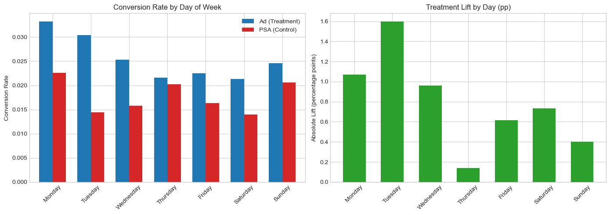
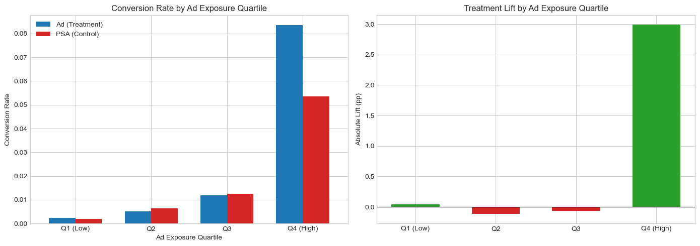
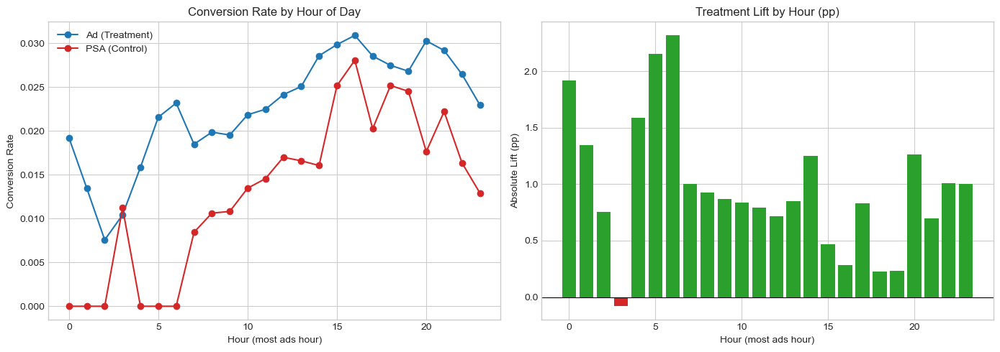
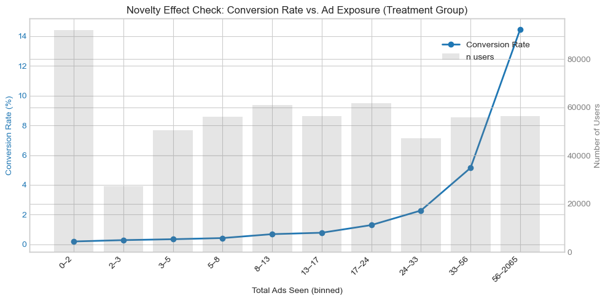

<h1 align="center">📊 Marketing Experimentation & ROI Decision</h1>
<h3 align="center">From A/B Testing to Business Go/No-Go Decision</h3>

<p align="center">
  
  
  
  
</p>

---

## 🚀 Business Impact (TL;DR)

- A/B test shows **+0.77 pp** conversion lift (**p < 0.001**)
- However, campaign is **not profitable** at current ad cost
- High-response segments identified: heavy users and early-week traffic
- Recommended **NO-GO rollout** unless CPM is reduced

👉 This project demonstrates how to translate experiment results into real business decisions.

---

## 🎯 Problem & Solution

**Problem**  
An ad campaign improved conversion, but the key decision was not just *"does it work?"*  
It was: **"should we scale it?"**

**Solution**  
Built an end-to-end decision workflow:

- Validated experiment integrity (SRM check)
- Estimated treatment effect (two-proportion z-test)
- Identified high-impact segments (heterogeneous treatment effects)
- Evaluated unit economics (incremental revenue vs ad-serving cost)

**Result**  
Statistically significant effect, but economically unviable at current CPM → **NO-GO**.

---

## 📊 Key Results

### Experiment Outcome

- Conversion lift: **+0.77 pp** (p < 0.001)
- Relative lift: **+43.1%**

### Business Impact

- Incremental revenue per user: **+€0.38**
- Ad cost per user: **+€1.24**
- **Net profit impact: negative at current CPM**

👉 Conclusion: **Statistically significant ≠ profitable**

---

## 💡 Business Recommendation

- ❌ Do not roll out campaign at current cost structure
- ✅ Target high-impact segments (heavy users, Tue/Mon, morning windows)
- 💰 Improve unit economics first (reduce CPM from **€0.05 → €0.03**)

Focus on **incremental profit**, not conversion rate alone.

---

## 📋 Analysis Pipeline (Technical)

```
Pre-launch Power Analysis → SRM Check → Primary z-Test
  → Heterogeneous Treatment Effects → Novelty Effect Check
    → Unit Economics & Go/No-Go Decision
```

| Step | What | Result |
|:----:|:-----|:-------|
| 1 | **Power Analysis** | MDE = 0.5 pp, required n = 15,670/group — dataset (588K) is massively overpowered |
| 2 | **SRM Check** | ✅ PASS — observed 96/4 split matches design (χ² p = 0.9998) |
| 3 | **Primary Test** | ✅ +0.77 pp lift, z = 7.37, p < 0.0001 |
| 4 | **Subgroup Analysis** | Lift concentrated in Tue/Mon (+1.6/+1.1 pp) and heavy-exposure users (Q4: +3.0 pp) |
| 5 | **Novelty Check** | ✅ No decay — conversion *increases* with exposure (Spearman ρ = 0.19) |
| 6 | **Unit Economics** | ⚠️ Incremental profit ≈ €0 — **NO-GO** at current CPM |

---

## 🎨 Visualizations

### Subgroup Analysis — Treatment Lift by Day of Week

<p align="center">
  
</p>

> **Tuesday (+1.60 pp)** and **Monday (+1.07 pp)** show 2–3× the average lift. Thursday is nearly zero (+0.14 pp). Ad scheduling should prioritize early-week slots.

### Subgroup Analysis — Treatment Effect by Ad Exposure Quartile

<p align="center">
  
</p>

> **Q4 (56+ ads)** drives almost all the lift (+2.99 pp). Q1–Q3 show near-zero or slightly negative effects — a classic dosage-response pattern.

### Subgroup Analysis — Treatment Effect by Hour of Day

<p align="center">
  
</p>

> **Early morning (6:00)** shows peak lift (+2.32 pp). Ad scheduling should prioritize morning slots for maximum ROI.

### Novelty Effect Check — No Decay Detected ✅

<p align="center">
  
</p>

> Conversion **increases** with cumulative exposure (ρ = 0.19), ruling out a novelty-driven false positive. However, this may reflect selection bias (engaged users see more ads).

---

## 🔬 Methodology Highlights

### Why This Project Stands Out

| Practice | What I Did | Why It Matters |
|:---------|:-----------|:---------------|
| **Pre-registration** | Defined MDE (0.5 pp) and power *before* looking at data | Prevents p-hacking and post-hoc rationalization |
| **SRM Check** | Chi-squared test on group sizes *before* any outcome analysis | A broken split invalidates everything downstream |
| **Subgroup HTE** | Stratified by day, hour, and exposure intensity | Average effects can mask critical heterogeneity |
| **Novelty Check** | Spearman correlation of conversion vs. exposure | Ensures the lift is sustainable, not a curiosity spike |
| **Unit Economics** | Computed per-user profit, not just conversion lift | Statistical significance ≠ business value |

### Interview-Ready Talking Points

> *"SRM is the first thing I check. If the split is broken, nothing else matters — I'd escalate to engineering before interpreting any lift."*

> *"I always look for heterogeneous treatment effects. A positive average ATE can be driven entirely by one sub-population — we need to know who to target before scaling."*

> *"A statistically significant result with negative ROI should never be rolled out. My job is to protect the business from expensive false confidence."*

---

## 🗂 Project Structure

```
ab-testing-roi-decision/
├── marketing ab test.ipynb     # Full analysis notebook (21 cells)
├── README.md                   # ← You are here
├── assets/
│   ├── eda_overview.png        # Data exploration overview
│   ├── subgroup_day.png        # HTE by day of week
│   ├── subgroup_exposure.png   # HTE by ad exposure quartile
│   ├── subgroup_hour.png       # HTE by hour of day
│   └── novelty_effect.png      # Novelty/primacy effect check
└── data/
    └── marketing_AB.csv        # 588K user-level observations
```

---

## 🚀 Quick Start

```bash
# Clone
git clone https://github.com/yingruma1999-hub/ab-testing-roi-decision.git
cd ab-testing-roi-decision

# Install dependencies
pip install pandas numpy matplotlib seaborn scipy statsmodels

# Open notebook
jupyter notebook "marketing ab test.ipynb"
```

---

## 📌 Key Takeaway

> **This project answers the question every PM should ask but rarely does:**
> *"We have a statistically significant result. Should we actually ship it?"*
>
> **Answer: No.** Not until we fix the unit economics. The data tells us *where* to focus (Tuesday mornings, heavy users) and *what* to negotiate (CPM ≤ €0.03). That's the difference between a data scientist who runs tests and one who drives decisions.

---

## 📂 Data Source

> **Marketing A/B Testing Dataset** from [Kaggle](https://www.kaggle.com/faviovaz/marketing-ab-testing). Fully anonymized (numeric user IDs only).

---

## 👤 Author

**Yingru Ma** · Data Analyst | Experimentation & Causal Inference

[](https://github.com/yingruma1999-hub)
